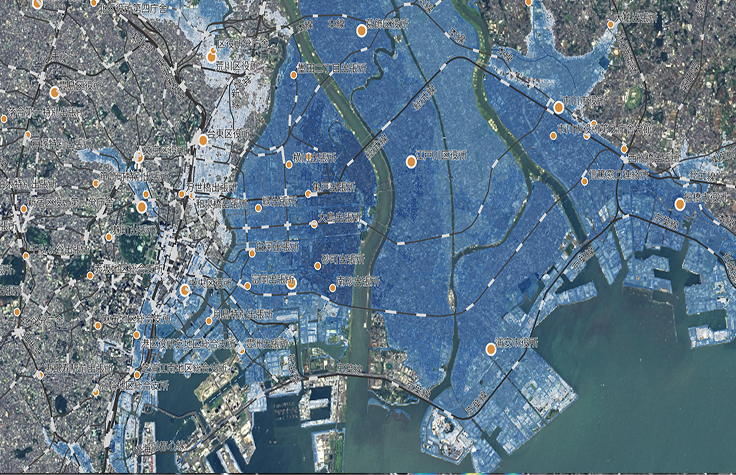
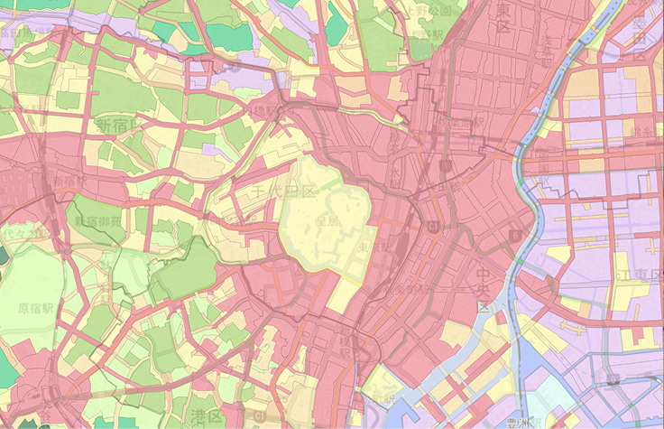
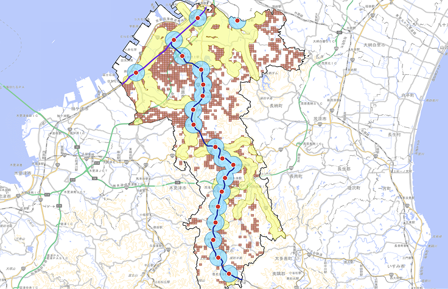
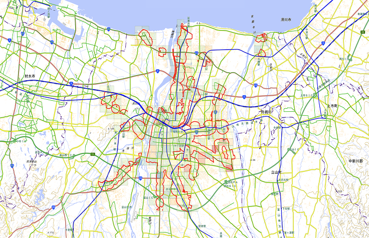

# QGIS Plugin for Kumoy

Turn your QGIS into cloud-native

<a href="https://kumoy.io/">
  
</a>

Kumoy lets you seamlessly push your QGIS projects to the web, safely manage data, and enable efficient teamwork.

## Showcases

<a href="https://app.kumoy.io/public/map/1c5855d5-be7a-4a2e-9980-a2caae297197">
  <br />
High Tide Flooding Risk<br />
https://app.kumoy.io/public/map/1c5855d5-be7a-4a2e-9980-a2caae297197
</a><br /><br />

<a href="https://app.kumoy.io/public/map/fa25ad67-d333-498e-87e8-ce89a3c0b386">
  </br />
Urban Planning Area<br />
https://app.kumoy.io/public/map/fa25ad67-d333-498e-87e8-ce89a3c0b386
</a><br /><br />

<a href="https://app.kumoy.io/public/map/6e81496d-77e2-43d5-b6dd-10bf423392e3">
  <br />
Transportation accessibility<br />
https://app.kumoy.io/public/map/6e81496d-77e2-43d5-b6dd-10bf423392e3
</a><br /><br />

<a href="https://app.kumoy.io/public/map/2ad587d4-ae5b-40bb-b9f2-fb26c1b94672">
  <br />
Population Analysis for Location Optimization<br />
https://app.kumoy.io/public/map/2ad587d4-ae5b-40bb-b9f2-fb26c1b94672
</a>

---

## Development

### Preparation

1. `uv sync`
2. Enable code completion for QGIS Python API in VSCode:
    - Modify `pyrightconfig.json` to include the path to your QGIS Python API in `extraPaths`
        - **macOS**: `/Applications/QGIS.app/Contents/Resources/python3.XX/site-packages`）
        - **Windows (OSGeo4W)**: ??
3. Set the Python interpreter in VSCode as the Python from the virtual environment created by `uv sync`.

## Running Tests

```bash
docker run --rm \
  -v "$(pwd)":/plugin \
  -w /plugin \
  qgis/qgis:3.40 \
  sh -c "
    pip3 install --break-system-packages pytest pytest-qgis &&
    xvfb-run -s '+extension GLX -screen 0 1024x768x24' \
      python3 -m pytest tests/ -v
  "
```
